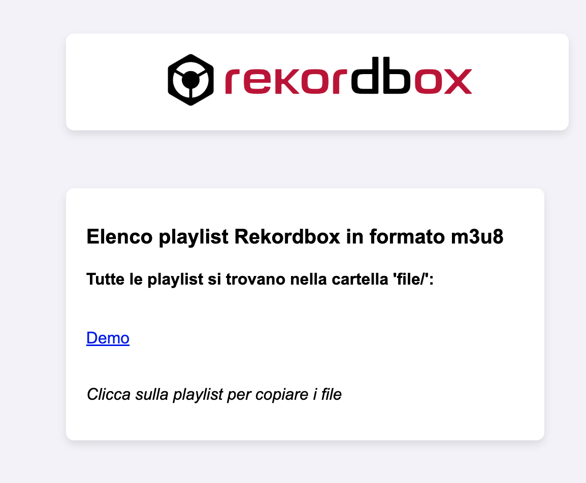
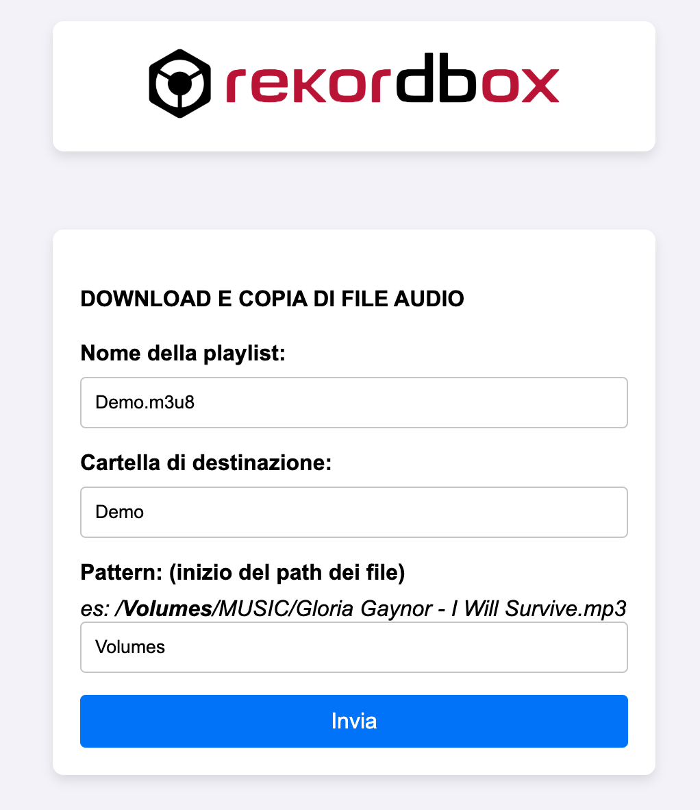
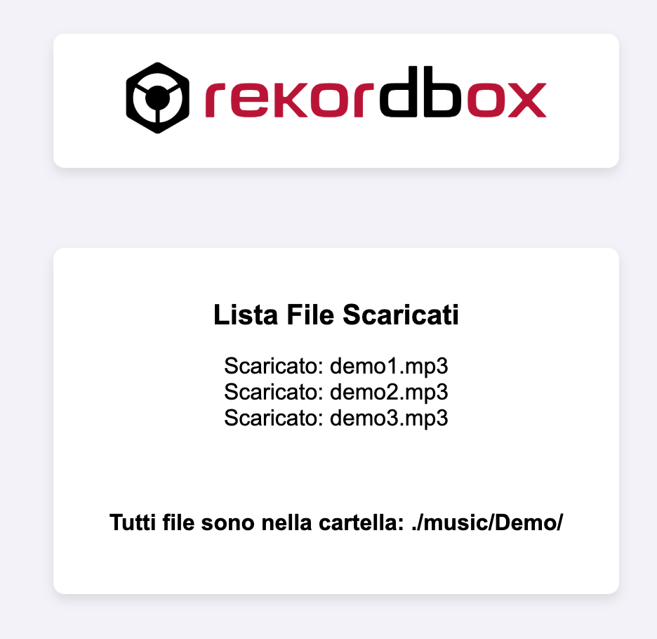

# Rekordbox Playlist Exporter

Uno script PHP per esportare non solo le playlist in formato `.m3u8` dall’applicazione **Rekordbox**, ma anche i file audio collegati. L’intero processo avviene tramite un’interfaccia semplice ed intuitiva e richiede un server locale per l’esecuzione.

## Funzionalità
- Importare file `.m3u8` delle playlist all’interno della cartella `file`.
- Scegliere da quale playlist esportare i file audio.
- Definire il percorso di destinazione per i file esportati.
- Scaricare automaticamente i file audio associati.

## Prerequisiti
- PHP 7.x o superiore  
- Server locale (es: [XAMPP](https://www.apachefriends.org/), [MAMP](https://www.mamp.info/), ecc.)  
- Rekordbox per la gestione delle playlist  

## Installazione
1. Clona questo repository nella tua macchina locale:  
   ```bash
   git clone https://gitlab.com/deejay-tools/rekordbox-export.git
   ```  
2. Avvia il server locale e punta alla directory del progetto.  
3. Assicurati che la cartella `file` contenga i file `.m3u8` delle playlist da cui desideri esportare i file audio.  

## Utilizzo
1. **Avvia il server locale**.  
2. **Accedi all’interfaccia web** (es: `http://localhost:8000/rekordbox-export/public`).  
3. **Seleziona una playlist** tra quelle disponibili.  
4. **Definisci il pattern del percorso dei file** audio collegati.  
5. **Scarica i file** nella cartella di destinazione scelta.  

### Operazioni principali
Una volta esportato il file della playlist in formato m3u8 da Rekordbox, posizionare questo file all'interno
della cartella di progetto denominata file.
A questo punto trovate la lista delle vostre playlist (se i file m3u8 sono più di uno), nella schermata principale
del progetto.
Cliccando su una di queste voci si aprirà un form all'interno del quale dovrete inserire il pattern del percorso
che è la prima cartella del path completo.

Esempio su MAC OS, con un disco esterno che ha label "MUSIC" il path sarà di questo tipo:
/Volumes/MUSIC
In questo caso il pattern per la regex è proprio Volumes

Verrà quindi fatto il parsing di tutti i percorsi all'interno del file m3u8 e di conseguenza il download dei file
della playlist. Il nome della cartella di destinazione all'interno della cartella /music del progetto sarà lo stesso del nome del file.

## Struttura del Progetto
```
/file                # Cartella per importare i file .m3u8 delle playlist  
/music            # Cartella dove verranno salvati i file esportati  
index.php           # File principale per l’interfaccia e la logica del progetto  
```

## Screenshot


### Scelta del file m3u8

### Scelta del pattern per la regex del percorso del file

### Schermata finale con i file e la cartella di destinazione



## Contribuire
Se vuoi contribuire al progetto, sentiti libero di fare un fork del repository e inviare una pull request!

## Licenza
Questo progetto è rilasciato sotto la licenza MIT. Consulta il file [LICENSE](LICENSE) per ulteriori dettagli.